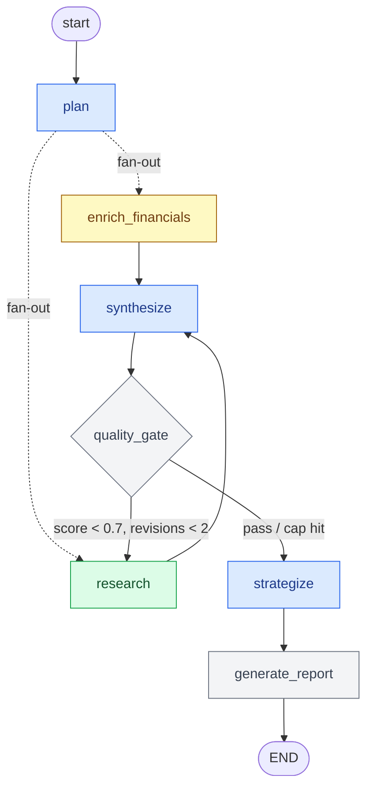
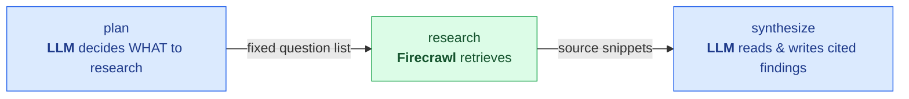

# Architecture — AI Research Copilot

## Overview

A LangGraph-powered research workflow that takes a company name, URL, and meeting objective
and produces a structured, source-grounded briefing in 8 sections. The user can then ask
follow-up questions over the persisted report via a RAG-lite chat interface.

```mermaid
flowchart LR
    user["React SPA"] -->|"REST + SSE"| api["FastAPI"]
    api --> graph["LangGraph workflow"]
    graph -->|"reasoning / writing"| llm[("DeepSeek / OpenAI")]
    graph -->|"web search + scrape"| fc[("Firecrawl")]
    graph -->|"checkpoint per step"| cp[("checkpoints.db")]
    api -->|"sessions · reports · chat"| db[("research.db")]

    classDef ext fill:#fef9c3,stroke:#a16207,color:#713f12;
    class llm,fc ext
```

The LLM and Firecrawl are the only two external dependencies. Everything else — orchestration,
state, persistence, streaming — is self-contained. See
[Reasoning vs Retrieval](#reasoning-vs-retrieval--how-the-llm-and-web-search-divide-work) for
exactly how those two are used.

---

## Stack

| Layer | Technology |
|---|---|
| Workflow orchestration | LangGraph 1.x (`StateGraph`) |
| LLM | DeepSeek / OpenAI via `langchain-openai` (OpenAI-compatible) |
| Web research + scraping | Firecrawl (`search` + `scrape_url`) |
| Financial data | Firecrawl search + LLM extraction (all company types) |
| API | FastAPI + uvicorn |
| Persistence | SQLAlchemy + SQLite (app tables) · AsyncSqliteSaver (graph checkpoints) |
| Streaming | Server-Sent Events (SSE) via FastAPI `StreamingResponse` |

---

## Graph



**Legend** — what each node calls externally:

| Color | Calls | Nodes |
|---|---|---|
| 🔵 Blue | **LLM only** (DeepSeek reasoning/writing) | `plan`, `synthesize`, `strategize` |
| 🟢 Green | **Firecrawl only** (web search/scrape) | `research` |
| 🟡 Yellow | **Both** — Firecrawl search → LLM extract | `enrich_financials` |
| ⚪ Grey | **Neither** — pure compute | `quality_gate`, `generate_report` |

### Conditional edges

**After `plan`**
- fans out to `enrich_financials` **and** `research` in parallel; both converge on `synthesize`
- `enrich_financials` runs for every company type (private firms still carry funding/valuation
  signal) — it's one cheap snippet search and, running concurrently with `research`, adds no
  time to the critical path

**After `quality_gate`**
- `quality_score < 0.7` AND `revisions < 2` → `research` (targeted re-research on gaps)
- otherwise → `strategize`

The re-research loop is the core quality mechanism. `MAX_REVISIONS = 2` is a hard cap
so the graph always terminates.

---

## Reasoning vs Retrieval — how the LLM and web search divide work

This is a **retrieve-then-read (RAG) pipeline, not an agent with tools.** DeepSeek has no
"web search" tool it can call; it never decides, mid-generation, to go fetch a page. The flow
is fixed and deterministic: the LLM plans *what* to research, Firecrawl mechanically retrieves
it, and the LLM reads the retrieved text back to write the briefing.



Three consequences worth being explicit about:

1. **DeepSeek never autonomously triggers a search.** The only intelligence steering retrieval
   is `plan` writing the sub-questions up front. Search relevance is capped by the quality of
   that plan — nothing recovers a missed angle except the gap loop.
2. **The model's own knowledge is used for *reasoning and writing*, never as a fact source.**
   This is deliberate: `quality_gate` scores "grounding" by counting `source_ids`, so every
   fact must trace to a retrieved source to stay citable. That's why even a household-name
   company is fully web-researched rather than answered from the model's memory.
3. **The re-research loop is gap-driven, not LLM-driven.** `quality_gate` deterministically
   detects missing/low-confidence sections and feeds those gaps back as new search queries —
   feedback by graph edge, not by tool-call.

The only node that chains both in a single step is `enrich_financials` (search → LLM extract);
the only node that *consumes* retrieval is `synthesize`. Everything else is purely one or the
other:

| Node | LLM (DeepSeek) | Web (Firecrawl) | Role |
|---|:---:|:---:|---|
| `plan` | ✅ | — | Decide what to research |
| `enrich_financials` | ✅ | ✅ | Retrieve + extract financials |
| `research` | — | ✅ | Retrieve evidence |
| `synthesize` | ✅ | — | Read evidence → cited findings |
| `quality_gate` | — | — | Score + emit gaps |
| `strategize` | ✅ | — | Reason over findings → strategy |
| `generate_report` | — | — | Assemble output |

> **Why this design over an agentic tool-calling loop?** A fixed plan→retrieve→read pipeline is
> cheaper (no extra LLM round-trips to decide each search), more predictable (you always know
> which searches will run), and easier to make grounded (retrieval is mandatory, not optional).
> The trade-off is less adaptivity — see `engineering-decisions.md` for the hybrid (LLM-drafts /
> search-verifies) we'd adopt to claw some of that back.

---

## Nodes

### `plan`
- **Input:** `company_name`, `company_url`, `objective`
- **Output:** `research_plan` (5–8 `ResearchTask` objects), `company_type`
- **LLM:** yes — decomposes the objective into sub-questions, one per report section;
  classifies company type (public / private / startup / unknown)

### `enrich_financials`
- **Input:** `company_name`, `company_url`
- **Output:** `financials` dict (market cap, revenue, employees, funding, etc.)
- **LLM:** yes — extracts structured fields from Firecrawl search snippets
- **Degradation:** on failure, sets `financials = {}` and appends to `errors`; graph continues

### `research`
- **Input:** `research_plan`, `gaps`, `company_url`
- **Output:** `sources` (accumulated), `scraped` (url → text)
- **LLM:** no — one Firecrawl `search` per sub-question, all fanned out concurrently via
  `asyncio.gather`, plus a single Firecrawl `scrape_url` of the company homepage
- **Snippet-only searches:** sub-question searches request results *without* `scrape_options`,
  so Firecrawl returns the result description rather than scraping each page's full markdown.
  Downstream only ever reads `Source.snippet`, so full-page scrapes were paid-for-then-discarded
  credits. Only the company homepage is scraped in full (synthesize reads it at `[:3000]`).
- **Re-entry behavior:** on second pass, runs only the targeted `gaps`, not the full plan
- **Degradation:** failed searches append to `errors` and are skipped; graph continues

### `synthesize`
- **Input:** `sources`, `scraped`, `financials`
- **Output:** `findings` for 5 factual sections, `confidence` per section
- **LLM:** yes — writes grounded prose; every finding cites specific `source_ids`
- **Sections:** `overview`, `products_services`, `target_customers`, `business_signals`, `risks_challenges`

### `quality_gate`
- **Input:** `findings`, `confidence`, `research_plan`
- **Output:** `quality_score`, `gaps`, `revisions`
- **LLM:** no — pure scoring logic

Score formula:
```
quality_score = (coverage + grounding + avg_confidence) / 3

coverage      = populated_sections / 5
grounding     = sections_with_source_ids / populated_sections
avg_confidence = mean(finding.confidence for populated sections)
```

Gaps are emitted for any section missing or with `confidence < 0.5`.

### `strategize`
- **Input:** `findings` (the 5 factual sections)
- **Output:** adds 3 strategic sections to `findings`
- **LLM:** yes — reasons over findings (not raw sources) to produce `discovery_questions`,
  `outreach_strategy`, `unknowns`

### `generate_report`
- **Input:** all `findings`, `sources`, meta fields
- **Output:** `report` dict (persisted to SQLite via `session_service`)
- **LLM:** no — deterministic assembly into `ResearchReport` schema

---

## State

One `ResearchState` TypedDict flows through every node. LangGraph checkpoints it after
every super-step into `AsyncSqliteSaver`, keyed by `session_id` as `thread_id`.
This gives free recoverability — an interrupted run resumes from the last checkpoint.

```
ResearchState
├── inputs:        session_id, company_name, company_url, objective
├── plan:          research_plan[], company_type
├── evidence:      sources[], scraped{}, financials{}
├── analysis:      findings{}, confidence{}
├── quality loop:  quality_score, gaps[], revisions
├── output:        report{}
└── observability: errors[], status
```

`sources[]` carries a `tier` field on every item:
- **Tier 1** — company's own domain / official filings (most trusted)
- **Tier 2** — reputable news outlets (Reuters, Bloomberg, TechCrunch, etc.)
- **Tier 3** — aggregators, blogs, third-party overviews

Tier drives confidence scoring in `quality_gate` and is surfaced in the UI as badges.

---

## Report Output

```
ResearchReport
├── session_id
├── company_name
├── generated_at
├── sections{}          ← 8 SectionFinding objects, each with content + source_ids + confidence
├── sources[]           ← all evidence with tier + URL
└── meta{}              ← quality_score, revisions, company_type, errors[]
```

**8 sections:**

| Section | Produced by | What it contains |
|---|---|---|
| `overview` | synthesize | Company background, scale, mission |
| `products_services` | synthesize | Product portfolio, APIs, key features |
| `target_customers` | synthesize | Customer segments, ICP |
| `business_signals` | synthesize | Revenue, growth, market position, recent news |
| `risks_challenges` | synthesize | Competitive threats, regulatory exposure, weaknesses |
| `discovery_questions` | strategize | 5–7 questions to ask in the meeting |
| `outreach_strategy` | strategize | Personalised angle, tone, value prop |
| `unknowns` | strategize | Remaining gaps to probe for in the meeting |

---

## Persistence (two separate stores)

| Store | Purpose |
|---|---|
| `AsyncSqliteSaver` (`checkpoints.db`) | LangGraph workflow state after every super-step — recoverability |
| SQLAlchemy SQLite (`research.db`) | User-facing app data: sessions, reports, chat messages |

These are intentionally separate. The checkpointer owns workflow state; the app DB owns
user records and chat history.

---

## Streaming

```
POST /sessions/{id}/run   → creates asyncio.Queue, starts graph.astream() as background task
GET  /sessions/{id}/stream → SSE endpoint drains the queue, emits {node, status} per super-step
```

Each node writes a human-readable `status` string into state. The background task pushes
`{node: "synthesize", status: "Synthesis complete"}` to the queue after each node completes.
The SSE client (React) renders this as a live progress indicator.

---

## LLM Configuration

All 4 LLM-calling nodes share one model, configured via env:

```
MODEL_PROVIDER=deepseek   # or "openai"
MODEL_NAME=deepseek-chat  # or "gpt-4.1-mini"
```

The `get_llm()` factory in `app/llm.py` is `@lru_cache`-d so the client is instantiated
once and reused across all nodes and chat turns.

---

## Failure Handling

Every external call (Firecrawl, LLM) is wrapped in `try/except`.
On failure:
1. A `NodeError` is appended to `state["errors"]` with `recoverable=True`
2. The node returns partial results and continues
3. `quality_gate` detects thin evidence via low coverage/confidence and emits gaps
4. Re-research on gaps is the recovery path — not a crash

The graph never hard-fails on a single bad API call.
